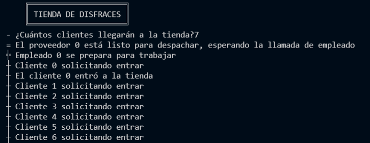
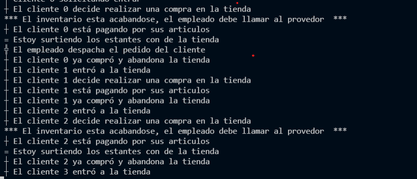

# Autores
- García Figueroa Munguía Alberto
- García Gutiérrez Edgar Cristóbal
#  👻🍫🛌💀🎃 Tienda de Disfraces 👻🍫🛌💀🎃

Erase una vez, en plena pandemia en 2021, dos estudiantes que necesitaban dinero porque sus becas nadamás no llegaban (100% real no feik). Imaginaron muchas maneras de conseguir dinero, pero en todas fracasaron rotundamente. Un miercoles se les acercó un hombre de saco ridículo con "100 empresas", barba y les preguntó "¿Qué prefieren 100 pesos o un consejo millonario?", por lo que sin pensarlo los estudiantes aceptaron el consejo millonario y emprendieron un negocio de disfraces y articulos para Halloween.
(aunque en realidad hubieran preferido los 100 pesos). 
Para que tuviera éxito su idea, planearon las siguientes reglas.

## Reglas de la tienda 🛒🛍

- Se permite un aforo máximo de hasta 4 personas en la tienda, los demás clientes deberán esperar a que salgan los clientes que esten adentro.
- Si se detecta que nuestra mercancia se está acabando, nadie puede pagar antes de que se vuelva a surtir la tienda.a
- El cliente deberá pagar y generar un ticket antes de poder salir.
- Los clientes que vayan llegando a la tienda, deberán formarse y entrar por turnos.
- Como el consejo millonario "funcionó", todo cliente que entre debe comprar.

## ¿Cómo se solucionó la administración de la tienda? 💡🤯💡
Para implementar las reglas de negocio propuestas, debemos usar un torniquete que administre la entrada de los clientes a la tienda, de otra manera no cumpliriamos la regla del aforo. Los clientes podrán acceder un a vez que otro cliente termine de 
hacer sus compras. De igual manera, usamos una barrera que permitirá cerrar la tienda una vez que todos los clientes hayan sido atendidos.
Para corroborar que el cliente pueda salir de la tienda, este debe de pagar sus productos para que de esta manera pueda generar su ticket y pueda salir de la tienda, para solucionar esta regla
utilizamos un patrón Rendezvous que permite la espera mutua entre que el cliente paga y se genera su ticket.
Finalmente pero no menos importante, el uso de mutex para administrar los recursos compartidos (en este caso la mercancia) sirve para asegurarnos de que un cliente
tenga asegurado su producto una vez reabastecida la tienda.

## Implementación 🔧 ⌨️ 🖥 🖱
Para representar la solución del problema, se creó un archivo nombrado main.py, en dicho código implementamos los siguientes patrones.
### Patrones de sincronización

**Barrera** 

Una vez que se crean y ejecutan los hilos del programa y se detecta que no hay clientes en cola, hacemos un join a todos
los hilos que se crearon para que vuelvan al flujo principal y termine la ejecución.

```python
 numClientes = int(input(" - ¿Cuántos clientes llegarán a la tienda?"))
    for k in range (1):
        hilos_proveedores.append(threading.Thread(target=Proveedor, args=[k])) #Creamos los hilos de los proovedores
        hilos_proveedores[k].start()
        time.sleep(1.5)
    for j in range (1):
        hilos_empleados.append(threading.Thread(target=Empleado, args=[j]))
        hilos_empleados[j].start()
        time.sleep(1.5)
    for i in range(numClientes):
        hilos_clientes.append(threading.Thread(target=Cliente, args=[i]))
        hilos_clientes[i].start()
        time.sleep(0.5)
    for k in range (1):     
        hilos_proveedores[k].join()
    for j in range (1):       
        hilos_empleados[j].join()
    for i in range(numClientes):
        hilos_clientes[i].join()
```

**Torniquete** 
El torniquete permite al código administrar la cantidad de hilos (clientes) que pueden ingresar a la tienda. Si los hilos quieren acceder a la zona crítica (la tienda), primero deberá de validarse que 
el número de hilos ejecutandose no sea mayor al aforo establecido, de otra manera deberán esperar a que el aforo disminuya.

```python
def Cliente(num):
    global contador_personas
    runCliente(num)
    entrada_mutex.acquire()
    contador_personas+=1
    if contador_personas < 4:
        entrar(num)
    entrada_mutex.release()
```
**Rendezvous**
Como se definió en las reglas de negocio, un cliente debe pagar y posteriormente generar su ticket para poder salir, en código esto 
es aplicar un patrón Rendezvous, ya que se implementaran dos esperas dependientes, porque para que pase una tiene que pasar la otra, en este caso
para generar el ticker primero se tiene que pagar.

```python
def pagar(numC):
    global ticket
    caja_mutex.acquire()
    print(" ┼ El cliente "+str(numC)+" está pagando por sus articulos")
    caja.set()
    while True:
        flag=ticket.wait()
        if flag:
            caja_mutex.release()
            salir(numC)
            break
        
    def Empleado(num):
    global id, caja
    runEmpleado(num)
    while(True):
        flag=caja.wait()
        if flag:
            print(" ╬ El empleado despacha el pedido del cliente")
            ticket.set()
            break
```
 


## Ejecución 🖥
El lenguaje de programación empleado es Python 3, se decidió usar este lenguaeje debido a su lo fácil que es desarollar el código. Se utilizaron 3 módulos estandar de python, los cuales son: threading, random, time
Para la ejecución debe emplearse el comando:

```shell
~:$ python main.py
```
Se nos solicitará que ingresemos el número de clientes que se vamos a recibir en nuestra tiendita

#### Ejemplos: 
Se podrá ver en ejecución






## Comentarios
Se trabajo de manera remota usando LiveShare, una extensión de VisualCode que nos permite programar de manera simultanea sobre el mismo archivo.
En la carpeta DEAD_CODE se encuentran los documentos que primero hicimos para separar en archivos las clases, sin embargo se optó por hacerlo en un archivo, adicional se encuentra un documento llamado documentacion.txt, el cual nos permitió definir el planteamiento del problema y posibles implementaciones.
A pesar de que al final no se consiguó implementar bien el patrón barrera, consideramos que lo que se desarrolló permitió tener una idea más clara para codificar una situación paralelizable.