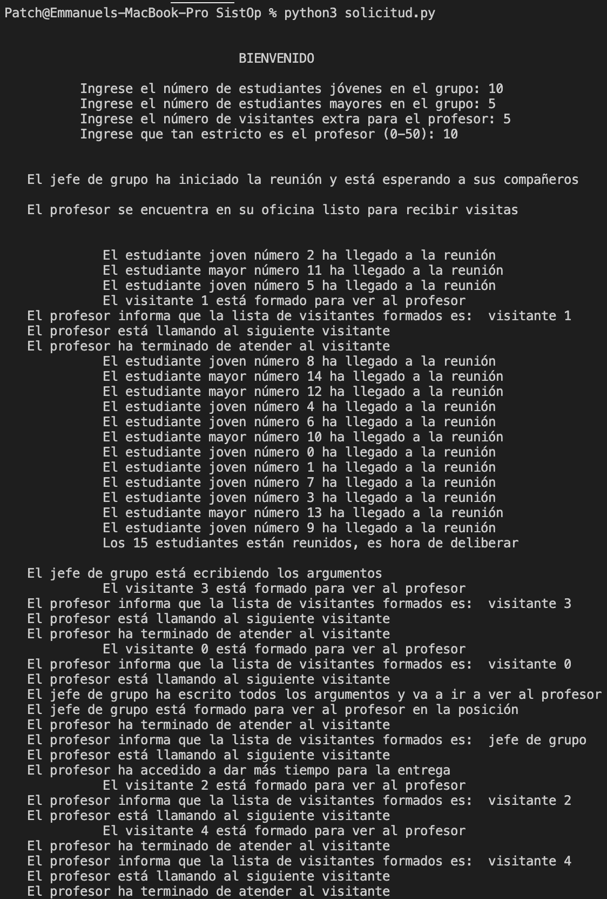
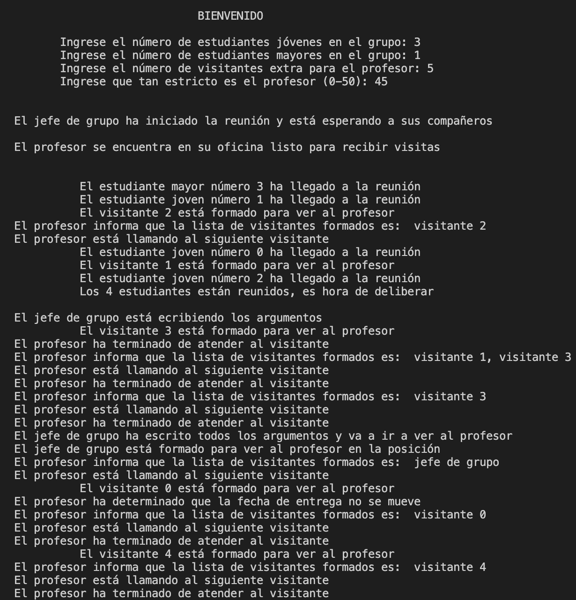

# Proyecto 2. Sistemas Operativos
### Manzanares Peña Jorge Luis
### Salazar Domínguez Jesús Eduardo

## Planteamiento
En una facultad de ingeniería, un grupo de alumnos siempre tiene mucha tarea y proyectos pendientes. Como a ellos les gusta dejar todo para última hora, siempre terminan quedándose sin tiempo para concluir sus trabajos oportunamente. Su solución es pedirle a su profesor que retrase la fecha de entrega de su asignación.

El grupo de alumnos cuenta con un jefe, el cual es el encargado de comunicarle al profesor sobre su solicitud de extensión de plazo (es el que se sacrifica por el equipo). Para que el jefe no se sienta solito, todos los alumnos del grupo se reúnen previo a la clase para comunicarle sus argumentos sobre por qué se debería extender el límite de tiempo. Están en una época pre-pandemia, por lo que pueden reunirse cara a cara sin preocupaciones.

Los jefes de grupo tienen una muy buena habilidad de comunicación oral, pero no tienen buena memoria. Por lo tanto, les gusta anotar todos los argumentos que sus compañeros les dan durante la reunión. Para no confundirlos, los estudiantes le dicen sus argumento al jefe de grupo uno por uno. Además, esperan a estar todos reunidos para comenzar, de forma que nadie se pierda de nada. Sin embargo, son un poco desorganizados, así que no tienen un orden específico, sino que el primero en hablar será el primero al que le tomen el argumento.

Al tratarse de grupos de semestres avanzados, existen alumnos de diferentes edades. Los estudiantes más jóvenes, se caracterizan porque sus argumentos suelen ser relajados y generan un ambiente amistoso con el profesor. Por otro lado, los estudiantes mayores proporcionan argumentos más serios, con razones válidas para retrasar la entrega.

Para que el profesor acepte la solicitud, debe haber un equilibrio entre ambos tipos de argumentos. Sin embargo, si hay demasiados de un solo tipo, entonces el profesor rechazará su petición y probablemente los estudiantes reprueben su asignación.

Por otro lado, el profesor es una persona ocupada, ya que suele tener otros visitantes en su oficina. Como él sí es organizado, les pide que se formen en una fila conforme van llegando, de forma que los atienda según el orden de llegada. Cuando el jefe de grupo esté listo, también deberá formarse antes de ver al profesor.

## Interpretación de las situaciones concurrentes
Como se puede observar, existen cuatro tipos de participantes en la situación: 
- Estudiante
- Jefe de grupo
- Profesor
- Visitante

Al ser los más numerosos, los estudiantes y visitantes serán los que caigan en situaciones concurrentes. La primera ocurre cuando los alumnos intentan comunicarle al jefe de grupo sus argumentos. Estos deben hablar uno por uno. Si esto no sucede así, entonces el jefe de grupo no podrá anotar todos los argumentos que le describan.

Otra situación a tomar en cuenta es que el jefe de grupo debe esperar a tener anotados todos los argumentos antes de ir a hablar con el profesor. En caso contrario, se podrían perder ideas importantes o romper con el equilibrio que se necesita para que la solicitud sea aprobada. Cuando finalmente esté listo, se podría encontrar con el resto de visitantes. Estos también deben ingresar uno por uno a la oficina del profesor, esperando su turno ordenadamente. De otra manera el profesor no podría entender los motivos de la visita de cada uno.

## Mecanismos
Para la simulación se crea un solo hilo para el jefe de grupo y otro hilo para el profesor. Por otro lado, el número de estudiantes y visitantes extra es determinado por el usuario. Además, el propio usuario puede definir el número de alumnos jóvenes y de alumnos mayores, así como cuán estricto es el profesor. De esta forma, cada ejecución puede arrojar un resultado diferentes con respecto a la resolución que se dé a la solicitud de los alumnos.

Cabe resaltar que la ejecución no es infinita, ya que no se definieron ciclos del estilo While-True, sino que cada hilo termina al finalizar su función. Esto se definió así porque, de lo contrario, en todas las repeticiones el profesor daría el mismo veredicto, ya que la proporción de estudiantes jóvenes y mayores sería la misma. Tampoco tendría mucho sentido que el usuario pudiera cambiar estos parámetros una vez iniciada la ejecución, ¡Desafortunadamente, las personas no podemos cambiar nuestras edades!

Se emplearon dos mutex, así como una estructura de tipo barrera para que el jefe de grupo espere a tener todos los argumentos antes de ir a hablar con el profesor. Además, tanto el profesor como el jefe se mantienen inactivos hasta que alguien los despierta con ayuda de los semáforos correspondientes.

Para el casos de las visitas del profesor, se implementó una lista, ya que así nos aseguramos de mantener el orden que tanto le gusta a él.

Las acciones efectuadas por los diferentes hilos se muestran en la línea de comandos.

## Entorno de desarrollo
Este proyecto se desarrolló y probó en dos sistemas operativos basados en Unix: MacOS (Catalina) y Linux (Fedora 34). En ambos sistemas nos apoyamos del editor Visual Studio Code (Nos gusta a pesar de ser de Microsoft profe, perdónenos D: ). El lenguaje de programación elegido fue Python, en su versión 3.8. Las bibliotecas importadas fueron **time**, **threading** y **random**, las cuales son necesarias para el funcionamiento del programa. Para ejecutar el programa, únicamente se requiere ingresar al directorio donde se encuentra el archivo solicitud.py y ejecutar la siguiente línea:

	$python3 solicitud.py

## Imágenes de una ejecución exitosa

