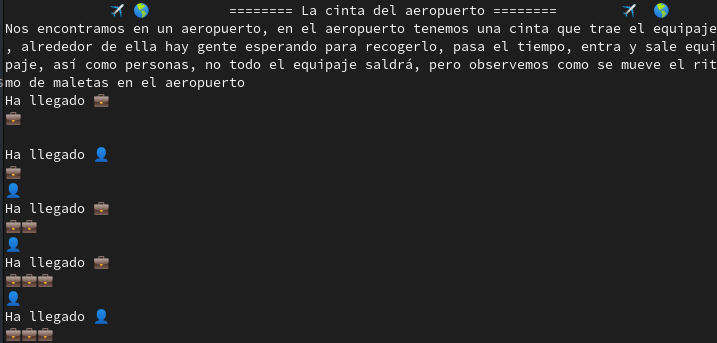
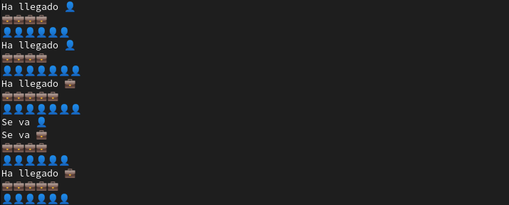
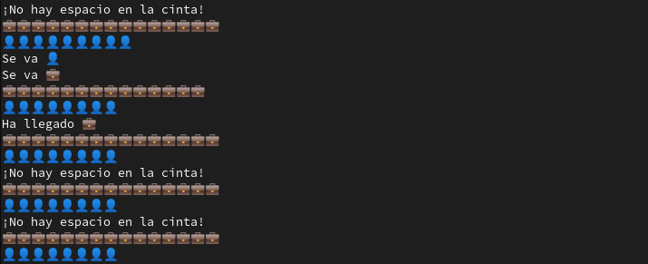

# Proyecto 1. S.O La cinta de maletas en el aeropuerto.


## Identificación y descripción del problema 🚀

### Situación

Hemos esperado mucho tiempo, pero después de casi dos años de espera, los viajes en avión vuelven a ser algo seguro (diferencias mas, diferencias menos), tener miedo a las alturas es el menor de sus preocupaciones, lo que de verdad te hace sentir miedo es... _¡la barra de maletas!_ o bueno la _¡Cinta de maletas!_ cualquiera que sea el nombre que le das te da _miedo_ recogerlas, no solamente porque hay muchas personas (Recuerdos de COVID) intentando recoger maletas, o porque entre tanto equipaje no observas el tuyo, tu mayor miedo es que te lleve la cinta, intenta perder el miedo y de paso resuelve el problema del equipaje.

De manera mas desglosada, en una _CINTA DE MALETAS_ a cada momento que pasa, entra equipaje, y del mismo modo sale, pero, nunca sabemos cuantas maletas entran y cada cuanto salen, ademas hay un limite de personas que se puede soportar estando alrededor de la cinta ( 20 personas alrededor de la cinta ), no es una misión fácil, pero valoras mas tu vida que otra cosa. El numero de personas y maletas (Normalmente serán 15 maletas en la cinta ) no sera siempre igual, ya que puede haber equipaje olvidado en el avión o incluso alguna persona despistada.

### Consecuencias nocivas de la concurrencia

Dada la información propuesta en la situación, podemos observar un aparente problema de tiempos, una persona pensaría mas en volver a su casa rápido, que en sacar su maleta con mas o menos personas, esto provocaría que no se respetaran los limites impuestos, ya que algunas personas no respetan las indicaciones propuestas/obligatorias. Posiblemente en el caso de que exista una revisión a maletas ⚠️ sospechosas ⚠️ no sera posible parar adecuadamente el proceso para llevarlo con calma. 


## Documentación 

### Mecanismos de sincronización empleados

Use los viejos y confiables mutex y semáforos, que a pesar de todo siguen siendo funcionales.
Cada vez que se va a ingresar una maleta o un pasajero hago que mediante un mutex se respete cuando se va a crear el hilo definido como maleta y pasajero. Ya que mediante el semáforo se van creando múltiples hilos que comparten recursos.

Función que permite observar el uso de mutex y semáforo
```python
def maletas():                  #maletas es la función que permite ingresar maletas a la banda, no recibe un argumento.
    global num_maletas
    global mutex_maletas
    global limite_pasajeros
    global limite_maletas
    global maletas_

    mutex_maletas.acquire()

    if (num_maletas == 15 and limite_maletas==False):
        limite_maletas = True
        mutex_maletas.release()
    elif (num_maletas >= 7 and num_maletas < 15 ):
        num_maletas += 1
        print("Ha llegado ", end="")
        ingresa("maleta")
        print("")       
        mutex_maletas.release()
    else:
        if(limite_maletas == False):
            num_maletas += 1
            print("Ha llegado ", end="")
            ingresa("maleta")
            print("")
            mutex_maletas.release()
            maletas_.acquire()
        elif(limite_maletas == False and num_maletas != 15):
            limite_maletas = True
        else:
            mutex_maletas.release()
            print("¡No hay espacio en la cinta!")

```

### Lógica de operación

Para la resolución del problema pensé en el anterior ejercicio desarrollado, el problema del rió, ya que sigue una logica similar, solo que en este caso hay que saber que tanto las entradas como las salidas son algo que no podemos controlar, nunca sabremos exactamente cuando un pasajero se llevara una maleta, y si en ese momento entra una nueva, o se llevan varios pasajeros maletas, claro esta que no se van a poder llevar la misma maleta.

Para la correcta ejecución del programa es necesario acceder a la carpeta:
```
.../proyectos/1/MorenoEduardo

```
Y ahi mismo ejecutar:
```shell
$ python aeropuerto.py
```
Una vez en el programa para salir es necesario dar doble Ctrl+C. De esta manera estaríamos forzando a interrumpir la ejecución. (Reconozco que es un bastante poco profesional dejar este tipo de errores, pero seguirá siendo mi Talon de Aquiles hasta que descubra como resolverlo)
### Entorno de desarrollo 📋
 El lenguaje empleado en este programa es Python 3.9.7.

 Se emplearon las siguientes bibliotecas las cuales corresponden a bibliotecas standard de python.
```python
import threading
import time
import random
import sys
import os 

```

El desarrollo de este programa se hizo en una interfaz de Linux, distribución Fedora 33, solo se probo en este equipo, así que la ejecución en Windows no se ha probado,

## Pruebas




## Comentarios y dudas.

De manera similar al desarrollo del ejercicio no logre cerrar con éxito el programa, es necesaria la utilización de un truco para salir de ejecución. Fuera de eso, siento que el programa es muy simple en cuanto a estructuras para resolver el problema, debería dedicar un tiempo a resolver mas problemas de este estilo, son una gran herramienta para poner a prueba la teoría, soy una persona un poco mas practica así que este tipo de ejercicios con mas frecuencia podrían ayudar a reforzar conocimientos. 

## Autores :construction_worker:

Moreno Peralta Angel Eduardo 


