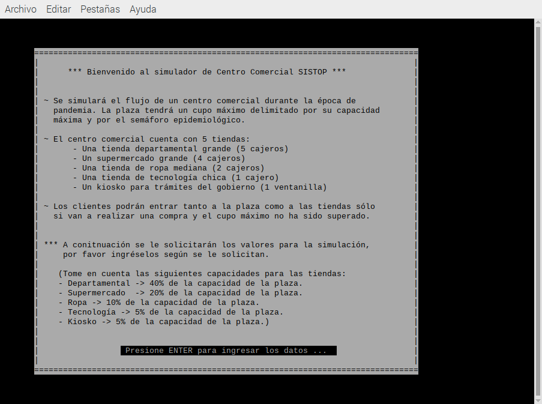

_Elaborado por: **Ordiales Caballero, Iñaky**_

# Una situación cotidiana paralalizable: "Centro Comercial"

> _Fecha de entrega:_ 26 de octubre del 2021.

## Identificación y descripción del problema

Como bien se menciona en las especificaciones del proyecto, existen muchos eventos 
de la vida real que pueden ser modelados como procesos paralelos o concurrentes. 
El hecho de que hubiera tantas opciones para escoger, pero que no fueran delimitadas 
por el profesor, hizo que me tardara en poder elegir una que considerara adecuada. 
Por mi mente pasaron varias ideas como modelar la reta de fútbol en el parque, o 
trabajar con situaciones de tráfico. Pero finalmente decidí modelar el flujo de un 
centro comercial en esta época de pandemia.


Como ya sabemos todos, debido a la pandemia global del covid-19 el gobierno de México 
instaló un semáforo que define el riesgo que presenta la situación sanitaria actual. 
Según el color de estos semáforos (siendo verde el de menor peligro y rojo el de mayor 
precaución) se crearon restricciones en el aforo permitido de los establecimientos 
comerciales. Este se calcula como un porcentaje de su cupo máximo normal y por norma 
no se puede rebasar. Fue esta situación por la que me decidí a modelar en mi programa, el 
control de entrada de las personas a un centro comercial e individualmente a las 
tiendas dentro de éste. 


Tanto en el evento real, como en la simulación existen diversos problemas de tener un 
evento concurrente. Uno podría ser el contabilizar el número de personas que ingresan 
y salen de la plaza a través de las diferentes entradas y salidas. Si se sobrepasa el 
límite del semáforo podría tener consecuencias legales y sanitarias (multas y 
enfermedades). Esto además pasa a su vez con cada tienda individual dentro de la plaza, 
las cuales también deben controlar su flujo de acceso. Otro posible problema es en el 
registro de la actividad financiera en cada tienda y en el centro comercial como un 
todo. Si se desea llevar el control de las ventas, el que cada cajero/empleado escriba 
en un lugar diferente y sin orden el registro de transacciones puede ocasionar que al 
final las cuentas no cuadren. Esto siempre lo queremos tener controlado, porque a 
nadie le gusta no saber qué pasó con su dinero.


Sin embargo, como en la vida misma, hay ocasiones en que la concurrencia no nos 
presenta problemas, por lo que el ordenamiento no resulta importante. En la situación 
modelada sí nos importa quien se forma primero fuera de las tiendas, pero una vez que 
entra ya es responsabilidad de cada quién cuánto tardarse y por lo tanto en qué orden 
salir del lugar. En otras palabras, nos preocupa la concurrencia en la entrada para 
que nadie se meta en la fila y no se rebase el aforo permitido, pero ya no nos concierne 
mientras el cliente ve los productos o mientras sale del establecimiento. Esto tomando 
en cuenta que no nos importa quién salga, pero sí saber cuándo lo hace.


 

## Mecanismos de sincronización empleados

En un principio quise utilizar casi todas las herramientas que revisamos en clase, 
porque todas se me hacen útiles al estudiarlas. Sin embargo, tuve que entender que no en 
todas las situaciones se deben de utilizar. Y que es mejor una solución clara y sencilla 
que una más compleja. Por lo tanto, utilicé los siguientes mecanismos de sincronización.


+ Semáforos:
  + Torniquetes: Sólo permiten un hilo a la vez, se pueden cerrar o abrir.
  + Mutex (candados): delimita una sección crítica (ej. Variables globales) y limitan 
el acceso a un hilo a la vez.
  + Multiplex: Son mutex de capacidad múltiple. Permiten a N hilos concurrentes en 
alguna sección.

+ Variables de condición: señaliza para que un hilo dormido (en espera inactiva) despierte 
para checar si una condición se cumple. Si se cumple continua su ejecución, sino vuelve 
a esperar.

### Utilización en el programa

A groso modo los mecanismos antes mencionados se usaron para los siguientes contextos 
de la simulación:


- **Torniquete**: para simular la apertura y cierre de la puerta principal de la plaza. Esta 
la lleva a cabo el hilo que simula ser un agente de seguridad. Cuando se cumple una 
condición, el agente abre el torniquete y los clientes pueden empezar a formarse y entrar 
a la plaza.

- **Variable de condición**: ésta se utilizó para despertar al agente de seguridad a la hora 
de abrir y cerrar el torniquete. El aviso se daba al inicio de la simulación y cuando 
había pasado determinado tiempo. De este modo el agente no entraba en espera activa.

- **Mutex**: se usaron principalmente para proteger las regiones críticas donde se modificaba 
las ventas o el número de cliente que se asignaba a cada persona. También se usó para las 
tiendas donde sólo había un cajero disponible.

- **Multiplex**: fueron los más importantes en mi implementación. Los usé para controlar el 
aforo tanto en el centro comercial completo, como en las tiendas individualmente. Me 
permitieron no llevar un contador, ya que solitos restringen el cupo máximo.
 

## Lógica de operación

### Estado compartido

El programa funciona principalmente con hilos clientes, fuera de ellos sólo se cuenta con el hilo 
del main y el del agente de seguridad que abre y cierra. Existen variables globales que son 
consultadas por todos los clientes como pueden ser el número de cliente, o las ventas de las tiendas 
que se modifican cada vez que un cliente realiza una compra. Además de las áreas críticas para la
obtención de un número de cliente, donde es importante que se protega para poder contabilizarlos 
de forma adecuada. Mis variables compartidas serían _bool abierto_ , las ventas individuales de 
cada tienda y _clientesAdentro_ la cuenta de los clientes que lograron entrar al centro comercial.

### Avance del proceso

+ Hilo **main**: su avance (dejando a un lado la parte gráfica) es muy simple y lineal. Primero 
presenta al usuario las instrucciones, le pide los datos para la simulación y a partir de estos 
inicializa los semaforos correspondientes, da valores a variables y crea al hilo agenteSeguridad. 
Si este no se crea, finaliza main ya que este hilo es necesario para la simulación. Después pasa 
a crear todos los hilos cliente, los cuales se atascan en un torniquete cerrado. Luego el main 
despierta al agenteSeguridad, espera el tiempo indicado por el usuario y vuelve a despertar al 
agenteSeguridad. Finalmente muestra los resultados en pantalla y finaliza el programa con 0.

+ Hilo **agenteSeguridad**: su proceso es el más reducido, una vez creado checa si la condición 
de que el centro comercial esté abierto se cumple, como al inicio nunca es así se duerme. Ahí 
espera a que alguien le avise un cambio y cuando lo hacen vuelve a checar la apertura del centro. 
En esta ocasión sí estára abierto, entonces el libera el torniquete de entrada para los clientes 
y vuelve a dormir esperando el cambio en la variable de condición. Finalmente será despertado 
por útlima vez para dar un anuncio y cerrar el torniquete.

* Hilo **cliente**: son los más activos e importantes. En un inicio al ser creados se atascan en 
un torniquete cerrado, cuando este se abre van pasando uno por uno tomando su numero de cliente e
intentan entrar al centro comercial. Si logran entrar, entonces pueden realizar de 1 a 3 compras 
en diferentes tiendas. Pero una vez seleccionan una tienda para entrar (representada con una función) 
deben de esperar a que un multiplex que limita la entrada se los permita. Cuando entren a la función 
de una tienda, realizarán su compra y tendrán que volverse a formar en un multiplex para acceder a la 
caja. Saliendo de la tienda irán a formarse a otra hasta acabar su número de compras. Inclusive cuando 
se cierra el torniquete de la entrada, los hilos clientes terminarán sus compras y hasta después 
saldrán y finalizarán. Por otro lado los que nunca lograron entrar en el cupo del centro comercial saldrán 
directamente de la fila y finalizarán.


### Interacción entre hilos

En esta parte me parece muy interesante de mencionar la interacción que realiza el hilo main y mi 
hilo de agente de seguridad. El hilo de seguridad es creado en el main, pero a la brevedad checa 
una condición y se pone a dormir (espera inactiva). Hasta el momento en que el main le indica que 
debe despertar mediante una variable de condición vuelve a despertar. Ahora la interacción es entre
el hilo de seguridad y los clientes, ya que es éste primero el que libera el torniquete de entrada 
para que los hilos clientes puedan avanzar en su proceso. 

Las mayores interacciones que encontramos no son directas, sino mediante el uso o espera de los 
semaforos del programa, ya que los diferentes hilos cliente se están constantemente esperando. Hay 
muchos semaforos que no protegen un área protegida, sino que son la base de la simulación del 
aforo máximo. Es con estos que interactúan entre sí, además de la lectura y modificación de las 
variables globales que de una u otra forma los acaba afectando en sus tiempos y definición.
 

## Entorno de desarrollo

Este proyecto fue desarrollado en el lenguaje de programación C, utilizando diferentes bibliotecas. 
La versión del compilador que se utilizó fue: 
> Gcc 8.3.0 Raspbian

El sistema operativo donde se probó y desarrolló en su completitud el proyecto fue en:
> Raspbian GNU/Linux 10 (buster)

la última versión del sistema operativo para la Raspberry PI. Basada en Debian. Y utilizando como 
idioma en la terminal: _es\_MX_. 


Para su funcionamiento se necesitó usar de dos bibliotecas a parte de las estándar del lenguaje:
+ _phtread_ de POSIX: para todo lo relacionado con los hilos y algunos mecanismos de sincronización.
+ _semaphore_ : para los semáforos y variables de condición.
+ _ncurses_ : para la realización de la interfaz de usuario.


Las dos primeras casi siempre las tenemos instaladas por default, pero en mi caso la tercera para 
la interfaz gráfica sí la tuve que instalar. En el caso de mi sistema operativo Linux la instalación 
se realiza de la siguiente forma:

````
sudo apt-get install libncurses5-dev libncursesw5-dev
````

### ¿Cómo compilar y ejecutar?

Para poder realizar una compilación correcta y exitosa del programa se requiere enlazar manualmente 
(diciéndole al compilador) las bibliotecas para pthread y ncurses. Por lo que no es tan directa la 
sintáxis como estamos acostumbrados. La forma correcta de compilar es con la siguiente línea:

````
gcc -o proy1 proyecto1.c -lpthread -lncurses -Wall
````

De este modo le decimos al compilador que compile el archivo llamado "proyecto1.c", la opción _-o_ dice
que el archivo resultante de la compilación lleve un nombre específico, en este caso "proy1". La opción 
_-lpthread_ dice que enlace la biblioteca pthread y la opción _-lncurses_ que enlace la de ncurses. Y 
finalmente la opción _-Wall_ indica que muestre todas las advertencias.

Ahora para su ejecución ingresamos a la terminal:

````
./proy1
````

Y eso debería ejecutarlo exitosamente. Para lograr usar la simulación el mismo programa es auto explicativo.

## Ejemplos de ejecución

**Muestra de compilación.**\

\

**Pantalla inicial del programa.**\

\

**Pantalla de instrucciones del programa.**\

\

**El usuario ingresa los datos**\

\

**Se le muestran al usuario los datos de la simulación.**\

\

**Se inicia la simulación en consola.**\

\

**Pantalla de los resultados de la simulación.**\

\

**Se termina la ejecución sin problemas ni errores.**\

\

Espero haya sido una interfaz aceptable para el programa :)\
