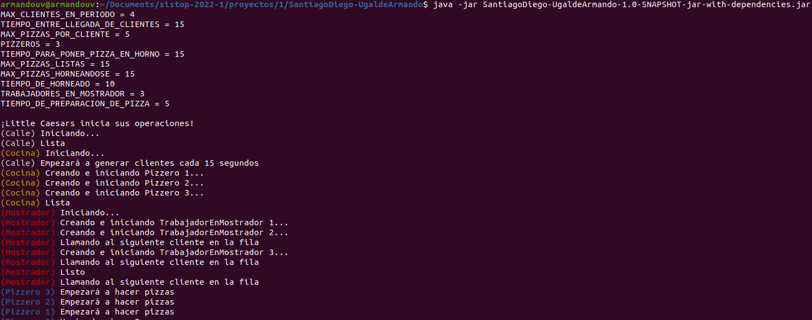

# Little Caesars

    Entrega: 2021.10.26

## Identificación y descripción del problema

Little Caesars es una cadena de pizzas internacional que llegó a México no hace muchos años. El funcionamiento de un
establecimiento, en pocas palabras, consiste en tener la cantidad mayor de pizzas posibles listas en un horno, para que
así, cuando lleguen los clientes, se les entregue la cantidad de pizzas deseada en el menor tiempo posible.

Analizando minuciosamente el problema, podemos identificar distintos actores o participantes en el establecimiento:

- **La calle**: De aquí vienen los Clientes.
- **Cliente**: Compra pizzas.
- **Fila**: Aquí se forman los clientes para ser atendidos.
- **Mostrador**: Donde los Clientes son atendidos.
- **Trabajador en mostrador**: Se encargan de atender a los clientes y darles las pizzas que piden.
- **Cocina**: Aquí se hacen las pizzas.
- **Horno**: Está dentro de la cocina. Aquí se hornean las pizzas y se sacan cuando están listas. Tiene dos partes: para
  pizzas horneándose y para pizzas listas.
- **Pizzero**: Se encarga de preparar las pizzas, meterlas al horno de horneado y esperar que estén listas para pasarlas
  al horno de pizzas listas.
- **Pizza**: Se autodescribe.

Una vez identificadas las partes del problema, podemos observar claramente que las acciones se llevan a cabo de forma
paralela, ya que todos se encuentran trabajando simultáneamente, pero, ¿por qué es un problema esto? Viéndolo desde otra
perspectiva, podemos percatarnos de que, en realidad, se tienen recursos compartidos y los agentes se comportan como
productores y consumidores. A continuación, se muestra una explicación detallada sobre lo anterior:

- **La calle**: Actúa como un productor de clientes y los coloca en la fila.
- **Fila**: Se trata de un recurso compartido, ya que la calle agrega clientes a ella (los produce) y los trabajadores
  del mostrador llaman al primero para atenderlo (lo consumen).
- **Trabajador en mostrador**: Podemos decir que es un doble consumidor, ya que llama al primero de la fila para
  atenderlo y posteriormente toma las pizzas listas del horno.
- **Horno**: Se trata de un recurso compartido, ya que los trabajadores del mostrador toman pizzas de él (las consumen),
  mientras que los pizzeros preparan y hornean las pizzas (las producen).
- **Pizzero**: Como se mencionó, prepara (produce) las pizzas y las coloca en el horno.

Ahora bien, podemos decir que este problema es el productor-consumidor, pero utilizando dos buffers (fila de clientes y
horno), un consumidor doble (trabajadores de mostrador) y dos productores (pizzeros y calle). Lo anterior nos permite
identificar fácilmente las dificultades que se tienen al resolverlo. Algunas de ellas son las siguientes:

- Al estar involucrados recursos compartidos, los trabajadores de mostrador deben de poder atender a un cliente y tomar
  una pizza sin tener conflictos entre sí, y deben de poder saber cuando pueden hacerlo (es decir, cuando haya clientes
  o pizzas disponibles). En términos de código, podríamos hacer analogía a posibles condiciones de carrera al tratar de
  accesar a las estructuras correspondientes.
- La calle debe producir una cierta cantidad de clientes en un periodo de tiempo. Se decidió considerar que la fila de
  clientes es infinita, por lo que no tiene límite de tamaño. Sin embargo, hablando en términos de código sí es
  necesario tener precaución al añadir clientes a la fila, ya que también los trabajadores del mostrador acceden a ella
  y se pueden producir condiciones de carrera.
- Finalmente, los pizzeros siempre tratarán de que los hornos estén llenos y prepararán las pizzas necesarias, pero
  deben saber cuándo se llenan para dejar de hacerlo.

Dicho lo anterior, concluimos que es necesario establecer ciertos mecanismos sobre quién y cuándo accesa a los recursos
identificados para evitar conflictos entre los agentes y modelar la situación correctamente. De igual forma, podemos
identificar algunas situaciones en las que el orden relativo de los eventos no influye en el comportamiento correcto de
la situación: por ejemplo, no importa el orden en el que los pizzeros hornean pizzas, ni el orden en el que los clientes
terminan de ser atendidos (por ejemplo, dos clientes pueden empezar a ser atendidos casi al mismo tiempoo uno puede
pedir más pizzas que el otro, y por ende se atiende más lento).

Para resolver el problema, se implementaron algunas estructuras de datos que permiten realizar operaciones atómicas y
cumplen con el comportamiento deseado. Específicamente, se implementaron tres: una ColaSegura, un ConjuntoSeguro y un
AcumuladorSeguro, las cuales se encuentran en el paquete utilidades y cuentan con documentación para explicar su
principio de funcionamiento. Sin ahondar en detalles de implementación, se utilizaron las primitivas de sincronización
vistas en clase para extender el comportamiento de estructuras de la librería de Java, de tal forma que se convirtieran
en thread-safe.

Recapitulando, el proyecto se encuentra dividido en las siguientes clases principales, que representan las distintas
partes del problema:

- **Calle**: Se creará un hilo para que clientes a la Fila cada cierto tiempo. Estas constantes estarán definidas en la
  clase utilidades.Constantes, y será posible modificarlas al momento de ejecutar el programa por medio de un archivo (
  más información sobre esto en la sección de ejecución). Se agregarán los clientes de forma segura gracias a que la
  fila utilizará una ColaSegura internamente.
- **Cliente**: Representa un Cliente a atender. Tendrá un ID único y un número de pizzasDeseadas.
- **Fila**: Utilizará una ColaSegura para formar clientes y llamar al primero de la fila para que sea atendido.
- **Mostrador**: Inicializará los trabajadores en mostrador como hilos, para que así atiendan a los clientes de forma
  paralela.
- **Trabajador en mostrador**: Funcionarán como hilos para atender a los clientes de forma paralela. Cada trabajador
  intentará llamar al primer cliente de la fila, y una vez que lo logre, obtendrá el número de pizzas deseado por éste
  del horno. Debido a que el horno utiliza estructuras seguras, no habrá problemas de condiciones de carrera causadas
  por los trabajadores tratando de obtener pizzas al mismo tiempo.
- **Cocina**: Inicializará los pizzeros como hilos, para que así traten de llenar el horno de forma paralela.
- **Horno**: Utilizará un ConjuntoSeguro para representar la parte donde se hornearán las pizzas, y una ColaSegura para
  las pizzas listas. Gracias a esto, las operaciones de hornear la pizza y pasarla al horno de pizzas listas se
  realizarán de forma atómica.
- **Pizzero**: Funcionarán paralelamente como hilos para preparar las pizzas, meterlas al horno de horneado y esperar
  que estén listas para pasarlas al horno de pizzas listas.
- **Pizza**: Se autodescribe.

Por último, es relevante mencionar que se encuentran ubicadas algunas utilidades en el paquete con el mismo nombre,
necesarias para el desarrollo del programa.

## Entorno de desarrollo y ejecución

Para el desarrollo del programa, se utilizó el lenguaje Java versión 11, además de las bibliotecas de utilidades
Lombok (para colocar getters y setters con anotaciones y demás funcionalidades) y Jackson (para obtener datos de
archivos JSON). El programa se desarrolló y ejecutó correctamente en Ubuntu 20.04.3 LTS.

Por motivos de conveniencia, se empaquetó el proyecto en un archivo jar, el cual se encuentra en el directorio raíz del
repositorio y tiene el nombre **SantiagoDiego-UgaldeArmando-1.0-SNAPSHOT-jar-with-dependencies.jar**. Para ejecutarlo,
es necesario tener instalada la máquina virtual de Java. Si se utiliza el manejador de paquetes apt, por ejemplo, el
siguiente comando cumpliría con la tarea anterior:

      $ sudo apt install default-jre

Para ejecutarlo, tomando en cuenta que el directorio actual es el directorio raíz del proyecto, se utilizaría el
siguiente comando:

      $ java -jar SantiagoDiego-UgaldeArmando-1.0-SNAPSHOT-jar-with-dependencies.jar

Es importante mencionar que es posible cambiar ciertos valores que utiliza el programa para simular la situación. Lo
anterior permite probar el programa utilizando diferentes valores de carga. Para hacerlo, se cuenta con el archivo
**constantes.json**, el cual se encuentra en el directorio raíz del proyecto. Este archivo se debe encontrar en el mismo
directorio desde el que se ejecuta el programa.

A continuación, se muestra una captura de pantalla de la ejecución correcta del programa:

 