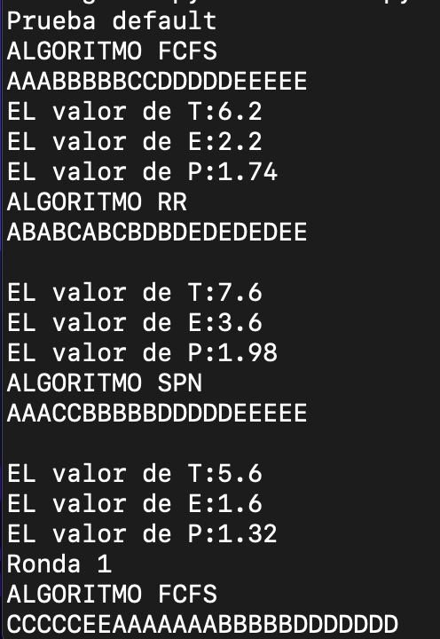
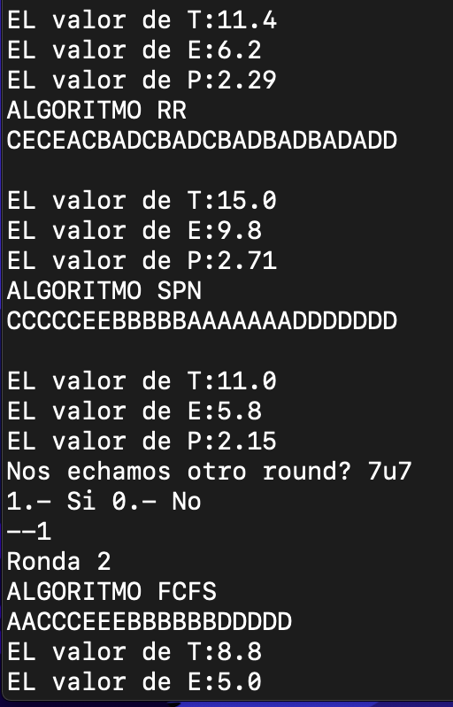

# Autores
- García Figueroa Munguía Alberto
- García Gutiérrez Edgar Cristóbal
#   Tarea 3
La tarea solicitó implementar los algoritmos de planificación. En este caso dicha implementación de los algoritmos
solicitados se hicieron en Python en su versión 3.9.6
## Ejecución 🖥
Para ejecutar el programa basta con realizar el comando 

```shell
~:$ python Tarea3.py
```
## Comentarios
En algunas ejecuciones del cálculo de los parámetros, suele arrojar una excepción de
lista vacíaa, por lo que se tuvo que tratar para que esta no termine con la ejecución del
programa, sin embargo no se pudo resolver esta situación, sin embargo se puede realizar otra
ronda para tener un resultado esperado. Otra observación es que no se pudo implementar de manera correcta el algoritmo
SRR, sin embargo se dejó como evidencia de nuestro intento.
#### Ejemplos: 





