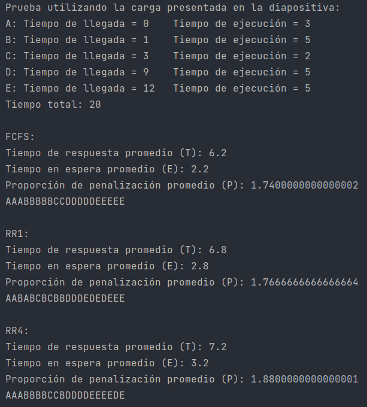
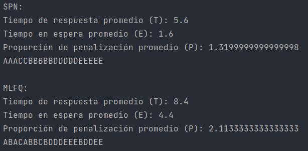
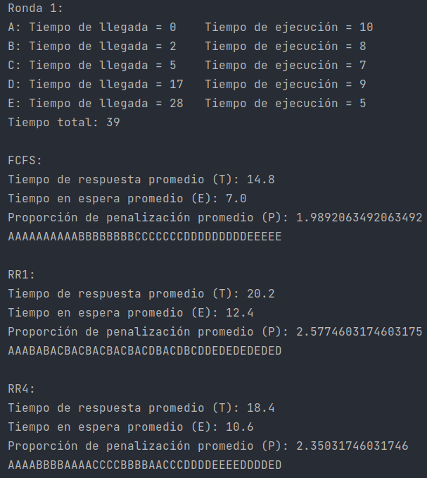
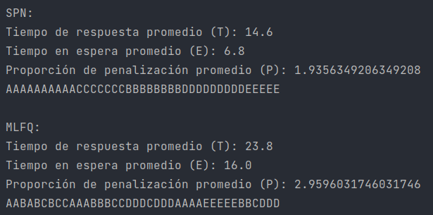
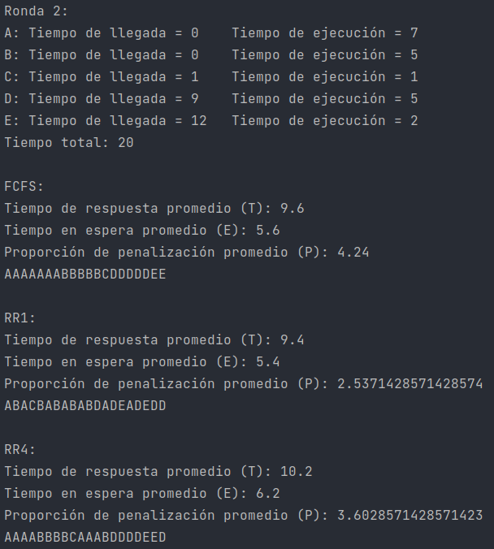
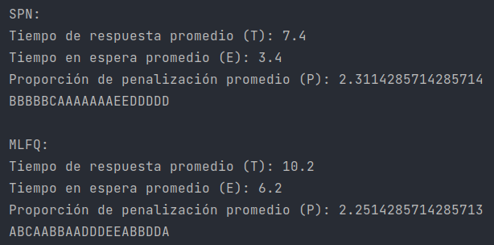

# Comparación de planificadores

    Entrega: 2021.11.04

Se implementó la **obtención de métricas** y **representación gráfica** para los siguientes algoritmos de planificación:

- FCFS
- RR1
- RR4
- SPN
- MLFQ **(Extra)**

De igual forma, se implementó la generación de cargas de procesos aleatorias, además de la ejecución de las simulaciones
utilizando la carga presentada en las diapositivas del curso. Para el caso anterior, se obtuvieron los mismos resultados
tanto de comportamiento como de métricas, excepto para el algoritmo RR1, donde se obtuvo un resultado diferente pero
igualmente válido. Una vez realizadas las simulaciones con la carga presentada en las diapositivas, se realizan 5 rounds
donde se generan cargas aleatorias en cada uno para efectuar las simulaciones de nueva cuenta y presentar sus
resultados.

El código cuenta con comentarios pertinentes para explicar su funcionamiento cuando éste no es del todo obvio. La clase
principal es **ComparadorDePlanificadores** y se puede tomar un enfoque top-down para comprender el programa partiendo
de ésta. La lógica principal de los planificadores se encuentra en las clases respectivas en el paquete **
planificadores**.

## Ejecución

Por motivos de conveniencia, se empaquetó el proyecto en un archivo jar, el cual se encuentra en el directorio raíz del
repositorio y tiene el nombre **SantiagoDiego-UgaldeArmando-1.0-SNAPSHOT-jar-with-dependencies.jar**. Para ejecutarlo,
es necesario tener instalada la máquina virtual de Java version 11 o mayor. Si se utiliza el manejador de paquetes apt,
por ejemplo, el siguiente comando cumpliría con la tarea anterior:

      $ sudo apt install default-jre

Para ejecutarlo, tomando en cuenta que el directorio actual es el directorio raíz del proyecto, se utilizaría el
siguiente comando:

      $ java -jar SantiagoDiego-UgaldeArmando-1.0-SNAPSHOT-jar-with-dependencies.jar

## Capturas de la ejecución del programa

 