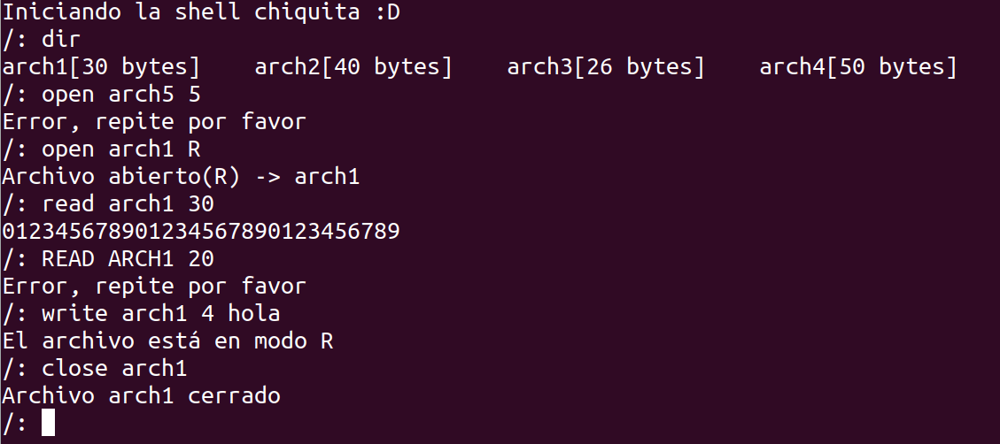
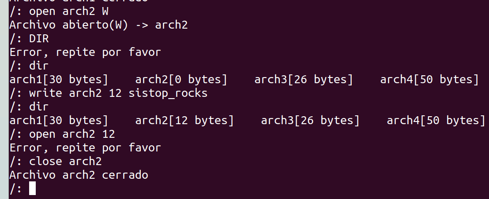
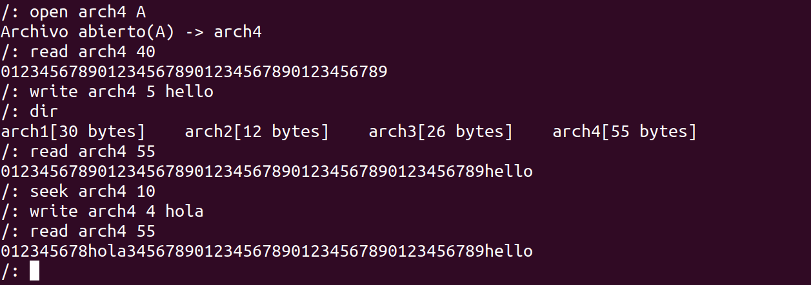

# Autores
- García Figueroa Munguía Alberto
- García Gutiérrez Edgar Cristóbal
#   Tarea 4
La tarea consistió en realizar una pseudo terminal que fuera capaz de ejecutar 
comandos que permitan interactuar con la interfaz lógica de manipulación de un directorio y los archivos que éste contiene.
## Ejecución 🖥
Para ejecutar el programa basta con realizar el comando 

```shell
~:$ python shell.py
```
si esto no funciona, realizar 
```shell
~:$ python3 shell.py
```
## Funcionamiento
Para poder usar la terminal, se deben respetar los siguientes comandos, ya que de no hacerlo la terminal 
rechazará el comando
dir → Muestra el directorio
open <nombreArchivo> <modo> → Especifica que operaremos con el archivo de
         nombre "nombreArchivo", empleando el modo especificado.
close <nombreArchivo> → Termina una sesión de trabajo con el archivo
         referido por el descriptor indicado. Después de un close,
		 cualquier intento por usar ese archivo entregará error.
read <nombreArchivo> <longitudBytes> → Lee la cantidad de bytes especificada
write <nombreArchivo> <longitudBytes> <Cadena> → Escribe la cantidad de
         bytes especificada en el archivo "nombrearchivo", guardando los datos indicados como parámetro "cadena".
seek <nombreArchivo> <PosicionBytes> → Salta a la ubicación del archivo en bytes especificada del
         archivo.
quit → Detiene la ejecución de la terminal


Existen 4 estados en los que puede estar un archivo
- C : El archivo se encuentra cerrado y es necesario abrirlo en una de los 3 siguientes maneras
- R : Modo lectura, solo podrá leer un archivo
- W : Solo pordrá escribir un archivo y empezando desde 0
- A : Podrá leer y escrubur un archivo, por default hará append al contenido pero usando seek se puede especificar donde se ingresará la cadena
## Comentarios
Sin duda alguna la elaboración y diseño de esta tarea fue muy fácil a compración de las otras y nos
ejemplifico una pequeña parte de como funciona un interprete de comandos para manipular archivos en la vida real
#### Ejemplos: 



