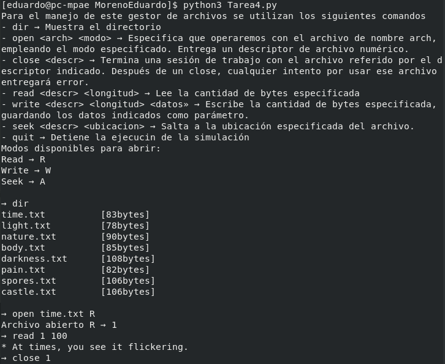
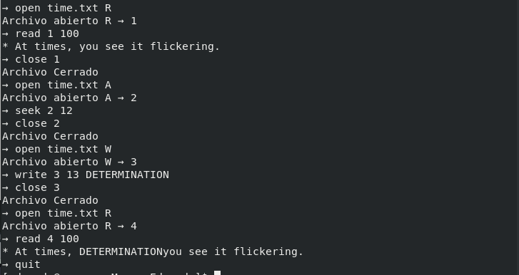

# Autor
- Moreno Peralta Angel Eduardo
#   Tarea 4
La siguiente tarea consiste en la ejecucion/simulacion de un administrador de archivos.
## Ejecución
Para llevar a cabo una ejecución exitosa es necesario tener instalado python y seguir la siguiente instruccion. 

```shell
python3 tarea4.py
```
## Funcionamiento
Para poder usar el programa de manera correcta en necesario tomar en cuenta algunas cosas.
- Los comandos open,seek,write,read,close,dir,quit deben de estar escritos en minusculas
- Los modos deben de ser escritos en Mayusculas.
- Se deben de respetar adecuadamente los nombres de los archivos, hay que escribir incluso la extension, en este caso *.txt
## Dudas y comentarios
El desarrollo de esta tarea fue sencillo, pero no quita que se tiene que hacer un estudio para saber como construirlo, antes de empezar a escribir codigo en bruto tuve que hacer un pequeño diagrama para intentar construirlo efectivamente.
## Prueba: 




