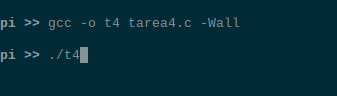
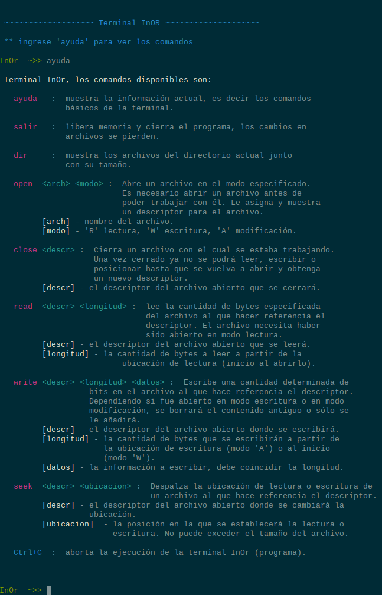
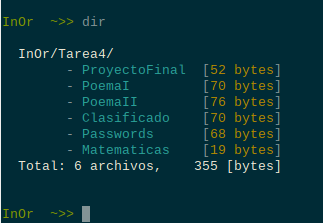
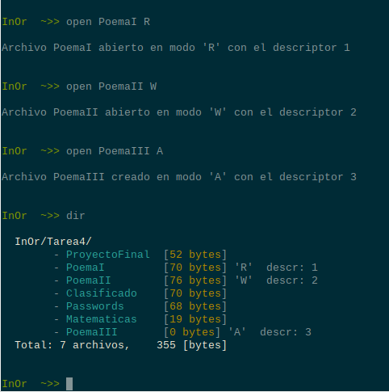
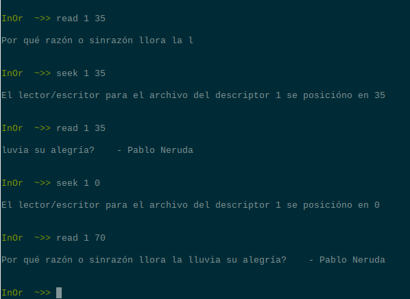
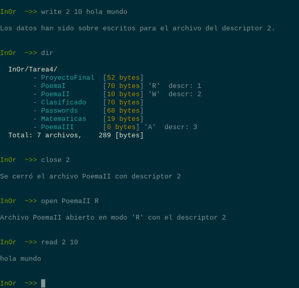
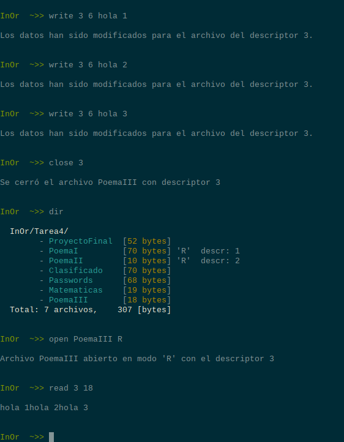
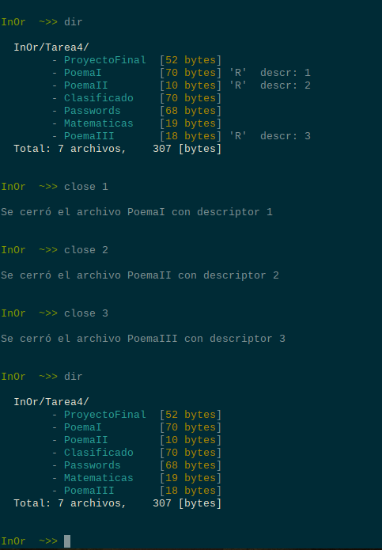
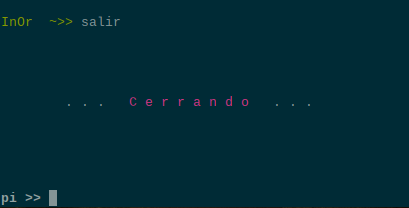

_Elaborado por: **Ordiales Caballero, Iñaky**_

# Tarea 4: "Implementando la semántica de archivos"

> _Fecha de entrega:_ 30 de noviembre del 2021.

## Introducción e instrucciones:

Los archivos se presentan al programador de aplicaciones como si fueran un flujo de 
caracteres que podemos ir pasando por una cabeza de lectura/escritura. A semejanza 
de la unidad de cinta, podemos pedirle al sitema que adelante o retroceda a una posición 
específica (seek()).


Los archivos, además, se estructuran en directorios. Un directorio es una estructura de 
datos que permite tener acceso a varios archivos, organizados de alguna manera (que no 
hemos abordado aún) en un medio de almacenamiento.

###Instrucciones:

Implementar un sistema interactivo con la interfaz lógica de manipulación de un directorio 
y los archivos que éste contiene. Manejar alguna estructura que no se grabe nunca a 
almacenamiento real. Pueden ser cadenas en la memoria.


## Requerimientos:

Al entrar al programa, debe presentarse un directorio, pre-cargado con pseudo-archivos, 
con el cual interactuar. Además de una breve explicación de como utilizar la interfaz.


Los comandos que se solicitan son:


+ Mostrar el contenido del directorio.
+ Abrir un archivo para lectura (R), escritura (W) o modificación(A).
  + Regresa un descriptor.
+ Leer un archivo.
+ Sobre escribir un archivo.
+ Añadir a un archivo.
+ Cambiar la posición de lectura/escritura del archivo.
+ Cerrar el archivo.


## Entorno de desarrollo y Ejecución:

Esta tarea fue desarrollada en el lenguaje de programación C, utilizando bibliotecas estándar.
Para su funcionamiento únicamente se necesita de tener instalado un compilador Gcc.


### ¿Cómo compilar y ejecutar?

La forma correcta de compilar es con la siguiente línea:

````
gcc -o t4 tarea4.c -Wall
````

De este modo le decimos al compilador que compile el archivo llamado "tarea4.c", la opción _-o_ dice
que el archivo resultante de la compilación lleve un nombre específico, en este caso "t4". La opción 
_-Wall_ indica que muestre todas las advertencias.

Ahora para su ejecución ingresamos a la terminal:

````
./t4
````

Y eso debería ejecutarlo exitosamente. Para lograr usar la interfaz el mismo programa es auto explicativo.

## Ejemplos de ejecución

**Muestra de compilación.**\



**Pantalla inicial del programa.**\



**Se muestra el directorio.**\



**Se abre un archivo.**\



**Se lee de un archivo.**\



**Se sobre escribe un archivo.**\



**Se agrega a un archivo.**\



**Se cierra un archivo.**\



**Se sale del programa.**\



Espero haya sido una interfaz aceptable para el programa :)


## Comentarios finales


El trabajo se me hizo interesante y en definitiva me ayudó a comprender mejor algunos conceptos
de la semántica de archivos, a pesar de que está muy simplificado. Creo que la parte un poco más
complicada fue el pelearme con la asignación de memoria dinámica de C, sobretodo al final para mi
variable int *datos que en realidad es una matriz de [n][5]. Fue complicado ver la manera de asignar
y recorrer sus valores. Al final estoy satisfecho con mi trabajo, espero le funcione tan bien como 
a mi. Por si acaso están las capturas de pantalla que prueban que a mí me funcionó.


